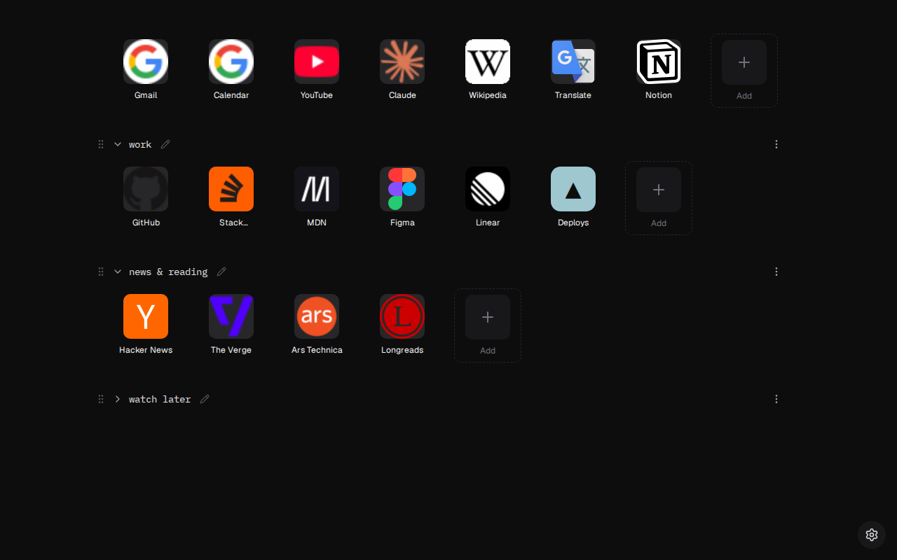
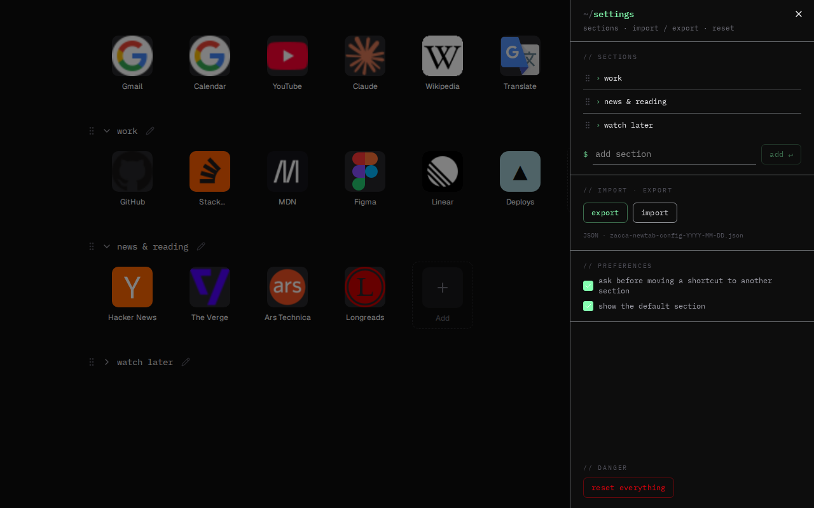
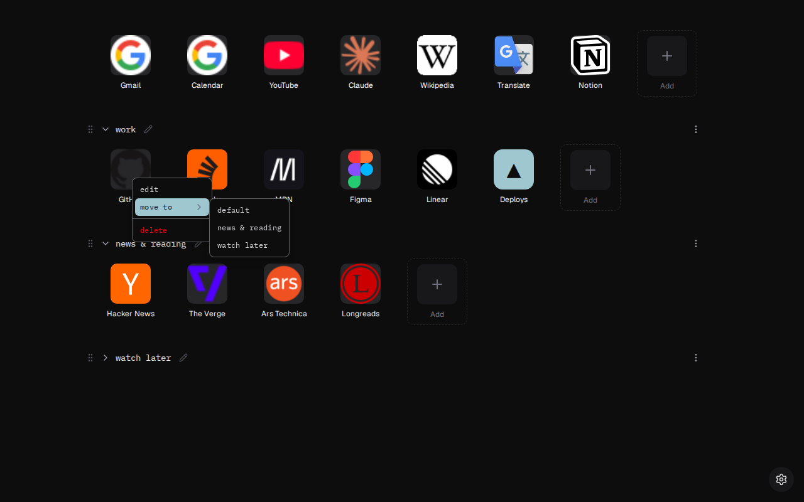
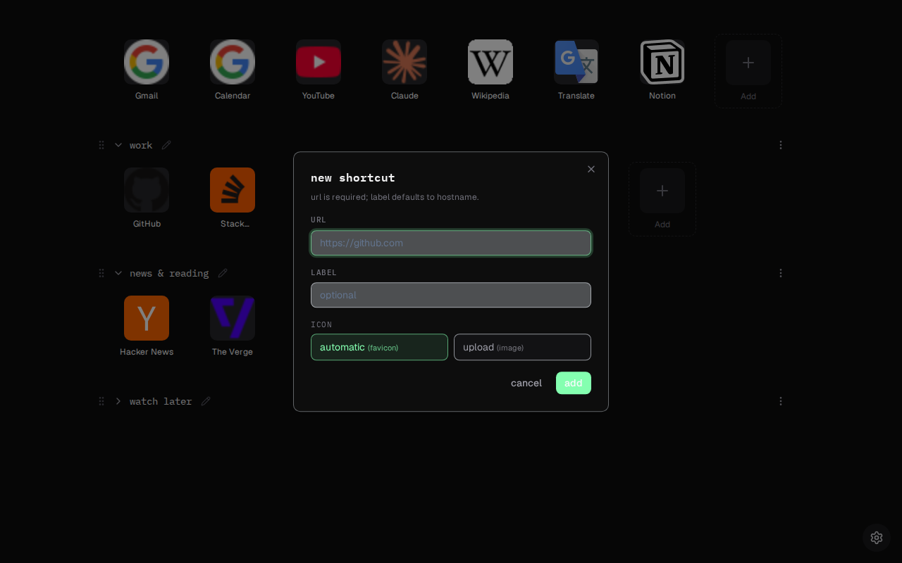

# zeetab

[](https://github.com/pZacca/zeetab/actions/workflows/ci.yml) [](https://chromewebstore.google.com/detail/okigemonkljchelokiilmfhdapecckel) [](./LICENSE)
<!-- Once the AMO listing is approved, add this badge to the block above:
[](https://addons.mozilla.org/en-US/firefox/addon/zeetab/) -->

A minimal new tab with shortcut sections — for Chrome and Firefox.

**Try it without installing:** https://zeetab.zacca.dev

<!-- AMO listing is in review. Once approved, point "Add to Firefox" to
     https://addons.mozilla.org/en-US/firefox/addon/zeetab/ and uncomment
     the Firefox Add-ons badge above. -->
[Add to Chrome](https://chromewebstore.google.com/detail/okigemonkljchelokiilmfhdapecckel) · [Add to Firefox](#)



<details>
<summary>More screenshots — settings, shortcut menu, adding a shortcut</summary>







</details>

Screenshots are generated from the web demo by `npm run screenshots`
(`scripts/screenshots.mjs`) — rerun it after UI changes.

## What it does

Replaces your browser's new tab page with a fast, offline, keyboard-friendly
grid of shortcuts:

- **Sections** — group shortcuts, name the groups (or don't), collapse them.
- **Drag & drop** — reorder shortcuts and sections freely.
- **Icons** — automatic favicons, or upload your own (stored locally).
- **Import / export** — your config is a JSON file you own; move it between
  browsers, machines, or the web demo whenever you want.
- **No account, no server, no tracking** — everything lives in your
  browser's localStorage. The only network requests are favicon lookups for
  the sites you pinned.

Settings open with `Ctrl/Cmd + ,`.

## Development

```sh
npm install

npm run dev            # extension dev mode (Chrome)
npm run dev:firefox    # extension dev mode (Firefox)
npm run dev:demo       # web demo dev server

npm run build          # build extension (Chrome MV3)
npm run build:firefox  # build extension (Firefox)
npm run build:demo     # build the web demo
npm run zip            # store-ready zip (Chrome)
npm run zip:firefox    # store-ready zip (Firefox)

npm test               # unit tests
npm run lint
npm run compile        # typecheck
```

Built with [WXT](https://wxt.dev), React, Tailwind CSS v4 and
[shadcn/ui](https://ui.shadcn.com) primitives.

## Repo docs

- [CONTRIBUTING.md](./CONTRIBUTING.md) — conventions and PR checklist.
  Privacy is a feature: changes that add network calls, telemetry, or
  remote code will not be merged (see [PRIVACY.md](./PRIVACY.md)).
- [CONTEXT.md](./CONTEXT.md) — glossary of domain terms.
- [docs/adr/](./docs/adr/) — architecture decision records.

## License

[MIT](./LICENSE)
